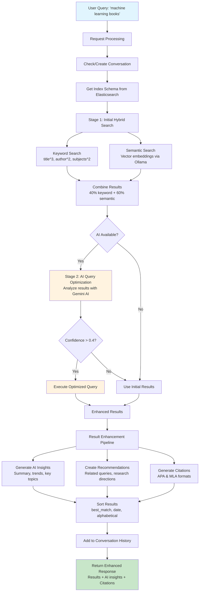

# RAG Search Endpoint Analysis - `/api/rag-search`

## Overview

The `/api/rag-search` endpoint implements an advanced multi-stage AI-powered RAG (Retrieval-Augmented Generation) search system that goes beyond traditional search by incorporating conversation context, AI optimization, and comprehensive result enhancement.

## Search Flow



## Architecture & Components

### Core Services Integration
- **GeminiService**: Google's Gemini AI for insights, summaries, and chat responses
- **ContextManager**: Maintains conversation state and search history
- **QueryEnhancer**: Legacy query enhancement (deprecated in favor of AI optimization)
- **ResultAugmenter**: Enriches search results with detailed analysis
- **RecommendationEngine**: Generates intelligent search recommendations
- **AIQueryOptimizer**: AI-powered query optimization using search results feedback
- **SchemaExtractor**: Analyzes Elasticsearch index structure for optimization
- **ResultSorter**: Provides multiple sorting strategies for results

## Multi-Stage Search Process

### Stage 1: Request Processing
```javascript
{
  "query": "search terms",
  "context": "additional context",
  "conversationId": "conversation_id",
  "preferences": { "dateRange": "2020-2024", "formats": ["book"] },
  "userId": "user_identifier",
  "sortBy": "best_match"
}
```

### Stage 2: Index Schema Analysis
- Extracts searchable fields from Elasticsearch index
- Provides AI optimizer with field structure and types
- Enables intelligent query construction

### Stage 3: Initial Hybrid Search
**Hybrid Search Strategy:**
- **Semantic Search**: Uses Ollama `nomic-embed-text` model for vector embeddings
- **Keyword Search**: Multi-field weighted search with fuzzy matching
- **Field Weighting**: title^3, author^2, subjects^2, publisher^1, description^1
- **Full-text**: searchableText field with 1.5x boost

### Stage 4: AI Query Optimization
**Intelligent Query Enhancement:**
- Analyzes initial search results to understand result patterns
- Uses Gemini AI to optimize query strategy based on actual data
- Confidence threshold: 0.4 (only applies optimization if confident)
- Fallback: Uses initial results if optimization fails or confidence too low

### Stage 5: Result Enhancement Pipeline
**Result Augmentation:**
- Detailed analysis of each result
- Contextual relevance scoring
- Cross-reference analysis

**AI Insights Generation:**
- Comprehensive result summarization
- Research trend analysis
- Key topics and authors extraction
- Quality indicators assessment
- Research strategy recommendations

**Citation Generation:**
- APA format citations for top 5 results
- MLA format citations for top 5 results
- Academic-ready reference formatting

**Recommendation Engine:**
- Related query suggestions based on results
- Research direction guidance
- Additional source recommendations
- Interdisciplinary connection identification

### Stage 6: Conversation Management
- Maintains persistent conversation state
- Tracks search history within conversations
- Provides contextual awareness for follow-up queries
- Supports user preferences across sessions

## Advanced Features

### Intelligent Sorting
**Available Sort Options:**
- `best_match`: Elasticsearch relevance score
- `publication_date`: Newest first
- `title_alphabetical`: A-Z sorting
- `author_alphabetical`: Author name sorting
- Custom sorting strategies via ResultSorter service

### Chat Interface (`/api/chat`)
**Conversational Search:**
- Natural language query processing
- Search intent detection
- Automatic query extraction from conversational text
- Context-aware responses using conversation history

**Search Intent Patterns:**
- "search for", "find", "look for", "looking for", "need"
- Automatic conversion to RAG search when search intent detected
- Fallback to general library assistance for non-search queries

### Fallback Mechanisms
**Multi-Level Graceful Degradation:**
1. **AI Services Down**: Falls back to basic search without AI enhancement
2. **No Embeddings**: Uses keyword-only search (100% weight)
3. **No Index**: Returns curated mock data matching query patterns
4. **Service Failures**: Comprehensive error handling with meaningful responses

## Response Format

```json
{
  "query": "original query",
  "originalQuery": "original query",
  "enhancedQuery": "original query",
  "conversationId": "conversation_id",
  "results": [/* search results */],
  "augmentedResults": {
    "results": [/* enhanced results */],
    "processingTime": 150
  },
  "aiInsights": {
    "summary": "AI-generated summary",
    "keyTopics": ["topic1", "topic2"],
    "keyAuthors": ["author1", "author2"],
    "researchStrategy": "systematic review approach",
    "nextSteps": ["review top results", "expand terms"]
  },
  "aiExplanation": "Why these results were selected",
  "aiOptimization": {
    "success": true,
    "confidence": 0.85,
    "reasoning": "optimization strategy explanation",
    "optimizedQuery": {/* elasticsearch query */}
  },
  "recommendations": {
    "relatedQueries": ["related query 1", "related query 2"],
    "researchDirections": ["direction 1", "direction 2"],
    "additionalSources": ["source type 1", "source type 2"]
  },
  "citations": {
    "apa": ["citation 1", "citation 2"],
    "mla": ["citation 1", "citation 2"]
  },
  "metadata": {
    "timestamp": "2025-07-02T01:01:19.864Z",
    "geminiEnabled": true,
    "aiOptimizationUsed": true,
    "searchApproach": "multi-stage-ai-optimized",
    "stagesUsed": ["initial", "ai-optimization"],
    "sortBy": "best_match",
    "processingTime": {
      "resultAugmentation": 120,
      "recommendations": 85
    }
  }
}
```

## Technical Implementation

### Elasticsearch Query Construction
**Enhanced Multi-Component Query:**
- Main multi-match query with field boosting
- Additional keyword queries for enhanced terms
- Semantic vector similarity scoring
- Filter support for date ranges and formats
- Configurable result size and field exclusions

### Error Handling Strategy
**Comprehensive Error Management:**
- Service-level error isolation
- Graceful degradation at each stage
- Detailed error logging with context
- User-friendly error messages
- Mock data fallbacks maintain API consistency

### Performance Optimizations
- **Async Processing**: Non-blocking AI service calls
- **Timeout Management**: 10-second timeout for embedding generation
- **Result Limiting**: Top 20 results for performance
- **Field Exclusion**: Embeddings excluded from responses
- **Caching**: Service availability caching to reduce latency

## Use Cases

### Research Applications
- **Academic Research**: Multi-faceted literature discovery
- **Systematic Reviews**: Comprehensive coverage analysis
- **Interdisciplinary Studies**: Cross-domain connection identification
- **Thesis Research**: Progressive query refinement through conversation

### Conversational Search
- **Natural Queries**: "Find me recent books about machine learning in healthcare"
- **Follow-up Questions**: Maintains context across multiple searches
- **Research Guidance**: Provides strategic direction for investigation
- **Source Quality Assessment**: AI-powered quality indicators

### Advanced Features
- **Query Optimization**: AI learns from result patterns to improve searches
- **Citation Ready**: Academic formatting for immediate use
- **Trend Analysis**: Identifies research patterns and gaps
- **Expert Identification**: Key author recognition and recommendation

## Comparison with `/api/search`

| Feature | `/api/search` | `/api/rag-search` |
|---------|---------------|-------------------|
| **Search Type** | Basic hybrid | Multi-stage AI-optimized |
| **AI Integration** | Basic embeddings | Full Gemini AI suite |
| **Context Awareness** | None | Conversation-based |
| **Result Enhancement** | Basic formatting | Comprehensive augmentation |
| **Citations** | None | APA/MLA automatic generation |
| **Optimization** | Static | Dynamic AI-powered |
| **Recommendations** | None | Intelligent suggestions |
| **Chat Interface** | None | Full conversational support |
| **Sorting Options** | None | Multiple strategies |

The `/api/rag-search` endpoint represents a sophisticated evolution of traditional search, providing AI-enhanced discovery capabilities suitable for serious research applications.